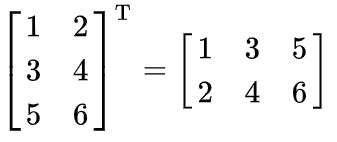

# PA 3: Debugging + Classes and Objects

## Assignment Overview
**Due date: Thursday, January 30 @ 11:59PM**

This assignment is divided into two parts. The first part will test your debugging skills and the second part will focus on your understanding of the concepts of classes and objects.

The first part of the assignment will require you to go over a given piece of code, understand its implementation and fix the different kinds of errors in the code so that it passes all of the given test cases and few other hidden test cases. You will also be expected to complete a `README.md` in which you will highlight the error you found in the given code, followed by its fix and explanation.

The second part of the assignment is an exercise in which you will create your own Matrix class with some variables and methods which include performing matrix addition, matrix multiplication and matrix transpose as described below in this writeup.

## Part 1: Debugging

### FunWithIntArrays.java
This class is designed to have some useful features for int arrays but is marred with errors (i.e. compile, runtime and logic errors). There are a number of methods in the class whose expected behavior is commented. You need to find and fix all the errors in this file and submit this file to Gradescope.

### ArraysTester.java
This code tests the class FunWithIntArrays. This file is to help you test your changes in the FunWithIntArrays class. You do not have to upload this file on Gradescope when turning in your work.

Create a new file called `README.md`. Write your name, CSE 8B login, and date at the top. 

_Make sure to read this whole section before beginning this portion of the assignment._

First, try to compile the FunWithIntArrays.java file. 
```
javac FunWithIntArrays.java
```
You will notice that several errors will occur and that the class will not be compiled. **Your task is to edit the FunWithIntArrays.java file in order to fix and record these errors.**

When you believe you have fixed the errors in the program, you can attempt to compile again with the `javac` command. If it compiles successfully, it will generate a file named `FunWithIntArrays.class`. This is the compiled version of `FunWithIntArrays.java`. Once this works, compile `ArraysTester.java` with `javac`. Then you can run the program with the command `java ArraysTester`.

### Your Task
1. Make a note of every error you find in `FunWithIntArrays.java` in README.md. Debug and fix these errors. List the bugs you found in `FunWithIntArrays.java` with a clear and concise description of why the bugs were wrong. Do not just list bugs you encountered in the assignment; your descriptions must detail the issues about the bug. They must be specific to `FunWithIntArrays.java`.
    - These errors can consist of compile errors, runtime errors, or logic errors (incorrect results). Logic errors will not necessarily cause the program to crash, so compare your results and the expected results carefully!
    - Fixing one error may get rid of multiple compiler warnings. This counts as one single error.
    - Minor misspellings (e.g. "Creating Initial Array" is spelled "Creating Initial Aray" in the output) are not errors, unless they cause compile/runtime/logic errors (e.g. some variable is misspelled). You may fix these if it makes you feel better.
1. Compile the ArraysTester.java test driver (original file).
1. Run ArraysTester. See if your output matches what is given below.

### ArraysTester Expected Output
```
Creating Initial Array:
7, 4, 1, 8, 12, 32, 64, 13 

Creating Array Copy:
7, 4, 1, 8, 12, 32, 64, 13 

Max element - Min element is: 63

Average value is: 17.625

Testing Reversed Array
13, 64, 32, 12, 8, 1, 4, 7

Testing Sorted Array
1, 4, 7, 8, 12, 13, 32, 64
```

### How To Document: Bugs

For example, if you fixed the for-loop below to avoid going out of bounds:
```java
for (int i = array.length; i >= 0; i--)
```
Your entry in README.md would look like:
```
Author: __Name__
Login: cs8bwi20__
Date: 2020 January 18th

## Debugging Code

Runtime Error - Array Index out of Bounds
Incorrect: for (int i = array.length; i >= 0; i--) 
Fix: for (int i = array.length - 1; i >= 0; i--) 
Explanation: Correction starts at the last element of the array which is at index array.length-1 rather than array.length.
// <Extra spacing>
<Next Error>
```
Put a newline between each error for readability. See above box where it says "\<Extra spacing>". 

## Part 2: Classes and Objects - Matrix Operations

In this part of the assignment, you need to design a class named `Matrix` (the file name should be named `Matrix.java`) Your class should contain the following `private` instance variables:
- An integer `row` that will hold the number of rows the matrix will have.
- An integer `column` that will hold the number of columns the matrix will have.
- A 2D integer array `arr` that will hold the elements of the matrix.

You need to also include the following two `private static final` strings in your class. These strings should be printed when two matrices cannot be added or multiplied respectively.
- String `ADD_ERROR` = "Matrices cannot be added"
- String `MULTIPLY_ERROR` = "Matrices cannot be multiplied"

Your class should contain the following methods:
#### - `public Matrix()`<br/>
The default constructor for `Matrix` class which will initialize your instance variables row, column to 0 and the 2D integer array to null.<br/>

#### - `public Matrix(int row, int column)`<br/>
The constructor for `Matrix` class which takes the integer inputs `row` and `column` and will be used for initializing your instance variables row, column and the 2D integer array. For example, creating an object as `new Matrix(2,2)` should create a matrix with 2 rows and 2 columns. If the parameters passed are invalid (negative numbers) then initialize your instance variables row, column to 0 and the 2D integer array to null<br/>

#### - `public Matrix(Matrix mat)`<br/>
The deep copy constructor for `Matrix` class which takes the Matrix object `mat` as an input and creates a deep copy of the matrix. The purpose of a deep copy constructor is to copy the contents of one object to another object and changing the copied object shouldn't change the contents of the original.<br/>

#### - `public boolean setElement(int r, int c, int element)`<br/>
A setter method that will set the value of a particular element in the matrix. It should take the row number, column number (in the zero-based indexing format) and the element to be entered in that particular cell as the inputs. For example, `setElement(1,1,20)` should set the element at 2nd row and 2nd column to the value 20. If the passed indices are valid, then the element can be set and it should return true after setting the element, otherwise return false. An invalid index would be any negative number or a number that exceeds the number of rows and columns in the matrix (as per zero indexing). <br/>

#### - `public Integer getElement(int r, int c)`<br/>
A getter method that will return the value of the element at the specified index (in the zero-based indexing format). It will take the row number and column number as the inputs and will return the value of the element at that index as an Integer. Integer class is a wrapper class for the primitive type int. However, you need not worry about creating an Integer instance. Just returning a variable of type int should suffice as it will be converted to an Integer object. For example, `getElement(1,1)` should return the element at 2nd row and 2nd column. If the passed indices are invalid, then return null (since the return type is an Integer class). An invalid index would be any negative number or a number that exceeds the number of rows and columns in the matrix (as per zero indexing).<br/>

#### - `public int getRows()`<br/>
A getter method that will return the number of rows in the matrix.<br/>

#### - `public int getColumns()`<br/>
A getter method that will return the number of columns in the matrix.<br/>

#### - `public String toString()`<br/>
A method to print the matrix out as a string in the specified format. This method should return a string as follows. For example: <br/>
1 2 3 <br/>
4 5 6 <br/>
7 8 9 <br/>

Add one space character after each element in the row. Add a new line character after each row. (Add a new line character even after the last row). Make sure you add `@Override` for the method signature. You can directly pass the variable that stores a reference to a Matrix object to either print() or println() and doing so will call that object's toString() function which is what you have implemented here. For example: you can directly use `System.out.println(m);` where m is an instance of the Matrix class.

#### - `public Matrix add(Matrix y)`<br/>
A method called `add` that will perform matrix addtion. The method will be called as follows: `x.add(y)` where x and y are Matrix objects. Thus, the method will take a matrix object as the input parameter and will perform addition by considering the object `x` that is calling the function as the first matrix and the matrix object `y` passed to the function as the second matrix. So you need to perform x+y and return the sum matrix object. If addition cannot be performed on the two matrices, print the contents of `ADD_ERROR` string and return null. If a null object is passed to the method, it should just return null.<br/> 

**Remember that the original `x` and `y` matrices should not be modified.** <br/>

A quick refresher on how matrix addition is done. Matrix addition can be performed between two matrices only if the number of rows  and number of columns match between the two matrices. (Make sure to include this check in your code and print out the `ADD_ERROR` string if the condition fails and return null). Adding the corresonding elements in the two matrices will give you the sum matrix. For example:<br/> 


#### - `public Matrix multiply(Matrix y)`<br/>
A method called `multiply` that will perform matrix multiplication. The method will be called as follows: `x.multiply(y)` where x and y are Matrix objects. Thus, the method will take a matrix object as the input parameter and will perform multiplication by considering the object `x` that is calling the function as the first matrix and the matrix object `y` passed to the function as the second matrix. (Do **NOT** interchange this order as matrix multiplication is **NOT** commutative) So you need to perform x*y and return the product matrix object. If multiplication cannot be performed on the two matrices, print the contents of `MULTIPLY_ERROR` string and return null. If a null object is passed to the method, it should just return null.<br/>

**Remember that the original `x` and `y` matrices should not be modified.** <br/>

A quick refresher on how matrix multiplication is done. Matrix multiplication can be performed between two matrices only if the number of columns in the first matrix matches the number of rows in the second matrix. (Make sure to include this check in your code and print out the `MULTIPLY_ERROR` string if the condition fails and return null). Multiplying the elements of a row in the first matrix with the elements of a column in the second matrix and summing them will give the product at one of the indices in the product matrix. For example:<br/> 


For more detailed explanation on how to perform matrix multiplication, you can check this [link](https://www.mathsisfun.com/algebra/matrix-multiplying.html).

#### - `public Matrix transpose()`<br/>
A method called `transpose` that will perform matrix transpose. The method will be called as follows `x.transpose()` where x is a Matrix object. It should return the transposed version of the `x` matix as a Matrix object. Remember that the matrix `x` should not be changed, the function should just return the transpose of the matrix `x`.<br/>

A quick refresher on how matrix transpose is done. Transpose is an operation which switches the rows and columns of a matrix. In other words, the rows become columns and columns become rows. For example:<br/>



Once you are done with designing the `Matrix` class, you can test it by running the `MatrixTester.java` file which contains few test cases with which you can verify if your code is working properly. You do not have to upload this file on Gradescope when turning in your work.

1. Complete coding and compiling the Matrix.java file.
2. Compile and run the MatrixTester.java. See if your output matches what is given below.

### MatrixTester Expected Output
```
Matrix m:
1 2 3 
4 5 6 

Number of Columns in Matrix m: 3
Number of Rows in Matrix m: 2
Element at 2nd row and 3rd Column in Matrix m: 6
Testing Matrix m + Matrix n
2 4 6 
8 10 12 

Testing Matrix m + Matrix l
Matrices cannot be added
Testing Matrix n * Matrix l
22 28 
49 64 

Testing Matrix m * Matrix n
Matrices cannot be multiplied
Transpose of Matrix m:
1 4 
2 5 
3 6 

```

## Student Satisfaction Survey

Please fill out our [student satisfaction survey](https://docs.google.com/forms/d/1vP64JWd7kj-zN53H6LRRO6YwVBeewma68VdCMbOoTig/edit). We are changing how we approach giving assignments and would like to hear about your experiences. After filling out the survey, please write the following sentence at the top of your `README.md` file: **I have completed the student satisfaction survey.** 

## Style
**Make sure you follow the below guidelines for styling since we will be grading you on it.**

We will grade your code style thoroughly. Namely, there are a few things you must have in each file / class / method:

1. File header
2. Class header
3. Method header(s)
4. Inline comments
5. Proper indentation
6. Descriptive variable names
7. No magic numbers
8. Reasonably short methods (if you have implemented each method according to specification in this write-up, you’re fine). This is not enforced as strictly.
9. Lines shorter than 80 characters (keep in mind each tab is equivalent to 8 spaces).
10. Javadoc conventions (@param, @return tags, /** comments */, etc.)

A full [style guideline](https://sites.google.com/eng.ucsd.edu/cse8b-winter2020/style-guide?authuser=0) can be found here. If you need any clarifications, feel free to ask on Piazza.

## Submission
Required Submission Files
- `FunWithIntArrays.java`
- `Matrix.java`
- `README.md`

*Good Luck!*
